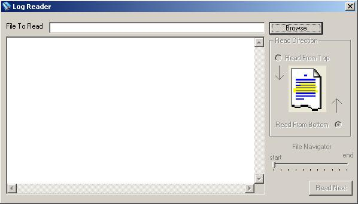



## Log Reader

### Description

This is user to read very huge log files (no size limit). Usually developers or DBA wants to view few last lines from huge log files produced at production servers and it is not feasible to read them in notepad or any other windows based program.This utility is used to read huge log files either from bottom or from top.This is very fast and user friendly utility and very useful for DBA or programers to read very large files.
 
### More Info
 
File to read

VB FileSystem and random file access

Displays the contents of file in Text Box

No side effect :- file is opened in read only mode

             |
---                |---
**Submitted On**   |2005-08-22 15:18:46
**By**             |[Rajneesh Noonia](https://github.com/Planet-Source-Code/PSCIndex/blob/master/ByAuthor/rajneesh-noonia.md)
**Level**          |Intermediate
**User Rating**    |4.7 (14 globes from 3 users)
**Compatibility**  |VB 5\.0, VB 6\.0
**Category**       |[Files/ File Controls/ Input/ Output](https://github.com/Planet-Source-Code/PSCIndex/blob/master/ByCategory/files-file-controls-input-output__1-3.md)
**World**          |[Visual Basic](https://github.com/Planet-Source-Code/PSCIndex/blob/master/ByWorld/visual-basic.md)
**Archive File**   |[Log\_Reader1927338252005\.zip](https://github.com/Planet-Source-Code/rajneesh-noonia-log-reader__1-62324/archive/master.zip)

